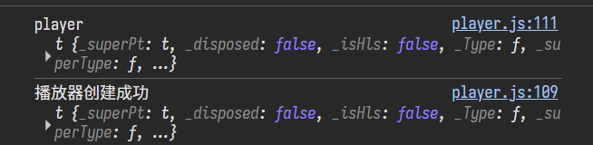

# 心理课网课刷课脚本

这是一个用于心理学在线课程的浏览器控制台脚本，旨在帮助用户快速完成课程视频观看任务并自动跳转到下一课。


## 免责声明

> [!WARNING] 
> **本脚本使用MIT协议开源，仅供学习交流使用，请勿用于违反学校规定或任何其他非法用途。使用本脚本可能导致不良后果，开发者不承担任何责任。请自行承担使用风险。**


## 主要功能

**强制完成视频：** 将当前课程视频标记为已完成，并将播放进度设为100%。

**模拟随机播放时长：** 视频播放时长将模拟在 10 到 14 分钟之间（12 分钟 ± 2 分钟）的随机值，使其看起来更自然。

**自动跳转：** 自动跳转到下一课。

**跳过论坛页面：** 自动识别并跳过指定的论坛页面，防止卡在非视频课程页面。

**静默模式：** 默认静默运行，除非出现错误，否则不会弹出烦人的 `alert` 提示。


## 使用方法

1.  **打开课程视频页面：** 登录在线教学平台，导航到任意一个视频课程页面。
2.  **打开浏览器开发者工具：** `Ctrl + Shift + I` 切换到 Console Tab。
3.  **等待播放器加载：** 播放器创建成功即可 `ctrl + V` 再次粘贴：

    
4.  **粘贴并运行代码：** 将以下全部代码复制粘贴到控制台中，然后按 `Enter` 键运行。

<!-- end list -->

```javascript
// 打开开发者模式的console,等到播放器成功载入后粘贴以下代码：

silent = true; // 默认静默，除非报错不弹出 alert
arr = window.location.href.split("id=");
const currentId = Number(arr[1]);

// 定义需要跳过的论坛页面 ID 列表，每一年可能不一样
// 请根据你当前课程的实际情况修改此列表，以确保跳过正确的非视频页面
const skipIds = [2089960, 2089977, 2089993, 2090010, 2090022];

// 生成随机播放时间（12分钟 ± 2分钟，即10到14分钟之间，单位秒）
const randomPlaybackTime = Math.floor(Math.random() * (14 * 60 - 10 * 60 + 1)) + 10 * 60;

var data = [{
    'index': 0,
    'methodname': 'mod_fsresource_set_time',
    'args': {
        'fsresourceid': playerdata.fsresourceid,
        'time': randomPlaybackTime,  // 使用随机生成的播放时长
        'finish': 1,    // 强制设置为已完成
        'progress': 100 // 进度强制设为100%
    }
}];

$.ajax({
    url: playerdata.siteUrl + "/lib/ajax/service.php?timestamp=" + new Date().getTime() + "&sesskey=" + playerdata.sesskey,
    method: 'POST',
    data: JSON.stringify(data),
    success: function(response) {
        console.log('强制完成请求成功', response);
        if (response[0] && response[0].data) {
            updateTableData(response[0].data);
        }

        let nextId = currentId + 1; // 默认下一个 ID

        // 检查计算出的 nextId 是否在 skipIds 列表中
        if (skipIds.includes(nextId)) {
            console.log(`检测到下一个 ID (${nextId}) 为论坛页面，正在跳过该页面。`);
            nextId += 1; // 如果下一个 ID 是论坛，则再加 1，跳过它
            if(!silent){alert(`下一个 ID (${nextId - 1}) 为论坛页面，已跳过，自动跳转至 ${nextId}。`);}
        } else {
            console.log(`下一个 ID 为 ${nextId}，正常跳转。`);
        }

        // 执行跳转
        window.location.replace(arr[0] + "id=" + nextId);
    },
    error: function(xhr, status, error) {
        console.error('请求失败', error);
        alert('强制完成请求失败，请检查控制台');
    }
});
```


## 注意事项

  * **`skipIds` 配置：** 脚本中的 `skipIds` 数组定义了需要跳过的页面 ID。由于不同年份或课程的页面 ID **可能**不同，你**必须**根据你当前课程的实际情况更新这个列表。如果脚本在非视频页面（如论坛、讨论区）卡住，请检查该页面的 URL 中的 `id=` 参数，并将该 ID 添加到 `skipIds` 数组中。（最后一个页面我没做判断）
  * **兼容性：** 本脚本基于**特定**的网课平台结构编写。
  * **静默模式：** 默认 `silent = true`。如果你想在每次跳转时看到弹窗提示（例如，当跳过论坛页面时），可以修改 `silent = false`。
  * **重复运行：** 每次完成一个视频并跳转后，你需要在新的页面中再次打开控制台并粘贴运行脚本。


## 进一步自动化

> 什么？竟然还需要我一个一个粘贴？太不自动化了！

如果你需要完全自动化整个课程的学习过程，你可以考虑使用 **Python 结合 Selenium**，实现一个完整的自动化流程，无需手动在每个页面重复粘贴和运行 JavaScript 代码。<del>我是懒鬼</del>


## 脚本没有反应？

- 请确保你已在正确的视频播放页面运行脚本。
- 检查控制台是否有报错信息，这通常能帮助你诊断问题。
- 确保页面中的视频播放器已经完全加载。
- 检查你是否使用了正确的 `skipIds`。

遇到错误，请收集错误信息，发布在 issue。
